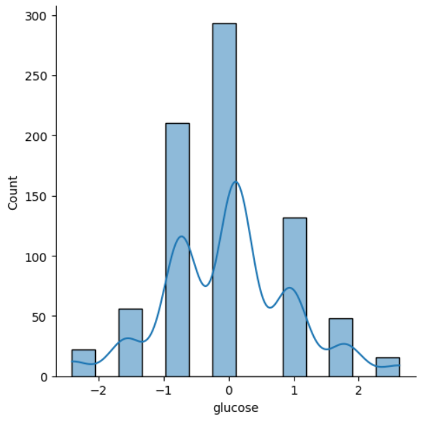
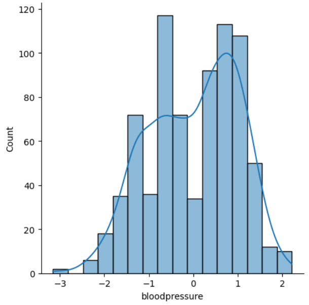
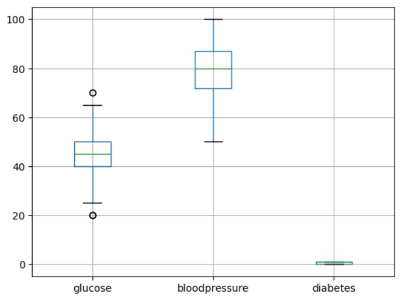

# Diabetes Classification Using Gaussian Naive Bayes

## 1. Project Overview

This project focuses on predicting diabetes status based on a dataset containing blood pressure and glucose levels of 995 individuals. We utilized descriptive statistics, implemented statistical methods for data preprocessing, and developed a Gaussian Naive Bayes classifier from scratch. The model was compared with the results in the original dataset and validated using the Gaussian Naive Bayes classifier from standard Python packages.

## 2. Methods

### 2.1 Data Description

- **Dataset**: Obtained from Kaggle, comprising blood pressure, glucose levels, and diabetes status of 995 individuals.
- **Features**:
  - Glucose: Quantitative variable representing glucose levels.

  

  - Blood Pressure: Quantitative variable.

  
  
- **Target Variable**:
  - Diabetes: Binary indicating diabetic or non-diabetic status.

### 2.2 Data Preprocessing

- Converted "diabetes" column to Boolean format.
- Addressed outliers using the Interquartile Range (IQR) method.

- Standardized data for uniform scale.

### 2.3 Data Splitting

- Divided the dataset into 80% training and 20% testing data.

### 2.4 Descriptive Statistics

- Computed mean, standard deviation, and variance for "blood pressure" and "glucose."
- Standardized data for zero mean and unit variance.

### 2.5 Testing Normality

- Conducted Shapiro-Wilk test for normality on blood pressure and glucose features.

### 2.6 Conditional Plots

- Utilized conditional plots to visualize glucose and blood pressure distributions for diabetic and non-diabetic individuals.

### 2.7 Naive Bayes Model

- Developed a custom class called NB to implement the Gaussian Naive Bayes model.
- Trained the model using prior probabilities and estimated parameters for feature distributions.
- Predicted diabetes status for the test set.
- Compared results with the Gaussian Naive Bayes classifier from Python packages.

## 3. Results and Discussions

- Identified multimodal distribution for glucose and bimodal distribution for blood pressure.
- Tested non-normality of features using the Shapiro-Wilk test.
- Achieved 94.87% accuracy with the custom Gaussian Naive Bayes classifier.
- Verified identical results with the Gaussian Naive Bayes classifier from standard Python packages.

## 4. Conclusion

- Successfully classified individuals as diabetic or non-diabetic using blood pressure and glucose measurements.
- Acknowledged multimodal and bimodal distributions for glucose and blood pressure, respectively.
- Gaussian Naive Bayes model achieved a high accuracy of 94.87%.
- Noted the assumption of independence in the Gaussian Naive Bayes classifier and potential influences between glucose and blood pressure.
## Contributers

<table>
  <tr>
   <td align="center">
      <a href="https://github.com/Nadaaomran">
        
         
        <b>Nada Omran</b>
      </a>
       
    </td>
    <td align="center">
      <a href="https://github.com/hadeerfasih">
        
         
        <b>Hadeer Fasih</b>
      </a>
       
    </td>
   <td align="center">
      <a href="https://github.com/Mariam-Hatem">
        
         
        <b>Mariam Hatem</b>
      </a>
       
    <td align="center">
      <a href="https://github.com/sarah1ibrahim">
        
         
        <b>Sarah Ibrahim</b>
      </a>
       

  </tr>
</table>
